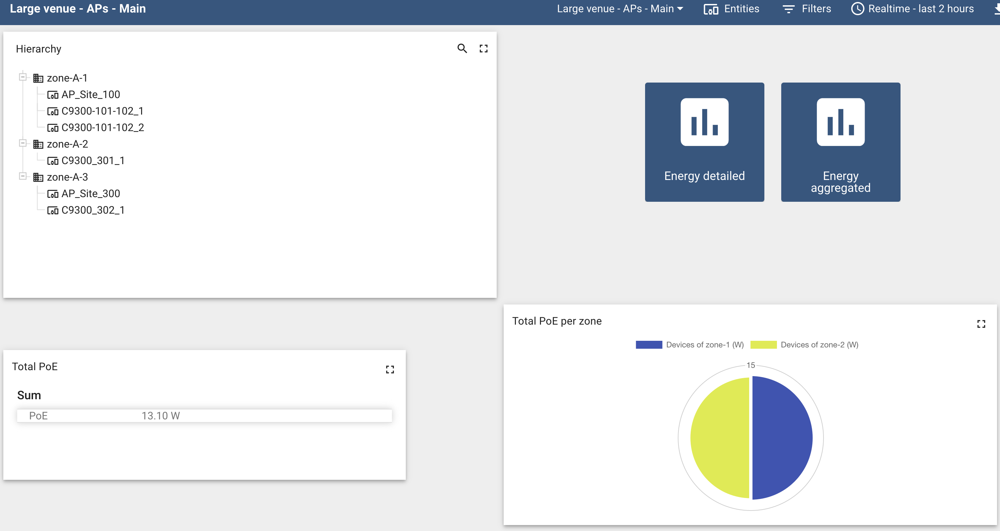
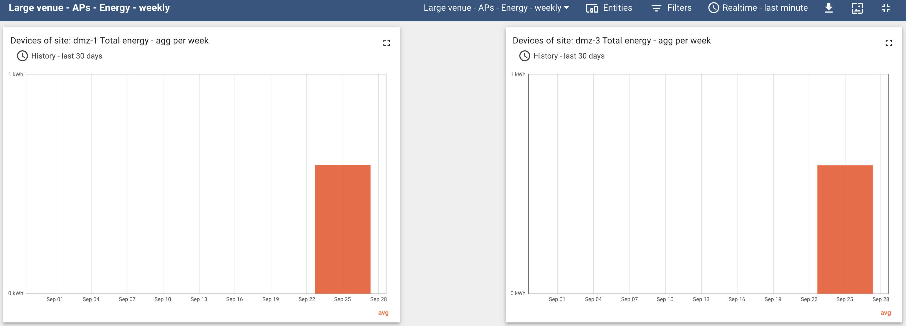
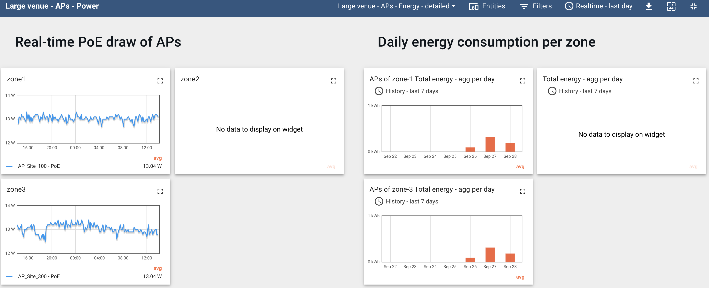

# Wifi-power-monitoring


This project provides a monitoring stack for the access points' (APs') energy consumption. The data is collected from Cisco Catalyst switches that provide PoE to the APs.






## Features

- data platform creation
- environment hierarchy onboarding:
  - site:
    - zones:
      - switches
      - APs
- CDP neighbors reading
- power and PoE reading of switches and APs
- optional environmental information
- data streaming
- data visualization
- data aggregation
- data exploration
- data persistence
- data export

## Services and workflow

```
onboard -> streamer-switches -> streamer-aps -> thingsboard

thingsboard -> exporter
```

## Prerequisites

Follow instructions for [RHEL](dependencies/rhel) or [Ubuntu](dependencies/ubuntu).

Create folder for Thingsboard's data: see file [dependencies/00.prep-filesystem.sh](dependencies/thingsboard/00.prep-filesystem.sh).

On RHEL, configure firewall for Thingsboard: see file [dependencies/01.config-firewall.sh](dependencies/thingsboard/01.config-firewall.sh).

Configure environment variables (see [.env.example](.env.example)):
```bash
cp .env.example .env
```
Optionally, configure settings (see [onboard/settings.ini](onboard/settings.ini)):
```bash
vi onboard/settings.ini
```

Configure authentication to Thingsboard's MQTT broker and HTTP API (see [onboard/thingsboard.yml](onboard/thingsboard.yml)):
```bash
vi onboard/thingsboard.yml
```

Install Dhall toolkit - for Linux - online/offline mode
```bash
bash dependencies/install-deps-config-generator.sh [online]
```

_Note_, for Mac and Windows, see corresponding packages here: https://github.com/dhall-lang/dhall-haskell/releases.

#### Launch the Thingsboard data platform service
```bash
docker-compose -f docker-compose-thingsboard.yml up -d thingsboard
```

Several endpoints will be available:
- http://HOST_IP:8080 - dashboard and REST API
- HOST_IP:1883 - MQTT broker

Load (import) the widget bundle and dashboards and edit their filters in Thingsboard - see files in [thingsboard/widgets](./thingsboard/widgets) and [thingsboard/dashboards](./thingsboard/dashboards).

For more information on the visualizations in Thingsboard, see [doc/thingsboard.md](doc/thingsboard.md).

## Real devices
### Configuration for real devices

Follow [steps for the generation of config files](./config-generator/README.md).

By default, internet connection is assumed and images will be built in the process of which packages will be downloaded from the internet. For this, we use the `docker-compose.yml` file.

Onboard the entities, collect power data:
```bash
docker-compose up -d onboard
docker-compose up -d streamer-switches streamer-aps
```

### Data streaming from real devices

The following lists the services for capturing data.

Switches' data streaming to Thingsboard; CDP neighbors and APs' data streaming to local disk:
```bash
streamer-switches
```

APs' data streaming from local disk to Thingsboard:
```bash
streamer-aps
```

Export APs' average PoE data to CSV:
```
exporter
```

Switches' data streaming to local disk for particular CLI commands (see `streamer/pyats-power/streamer_switches_extra.py`):
```
streamer-switches-extra
```
This service expects a configuration file at `onboard/minimal-testbed.yml` shorter or identical to the original `testbed.yml` file that is generated.

## Offline onboarding
set `IS_OFFLINE` to `true` in `.env` and launch the onboarding container:
```bash
docker-compose up -d onboard
```

## Visualization
http://HOST_IP:8080

See [doc/thingsboard.md](doc/thingsboard.md) and the sample dashboards and widgets in the [thingsboard](thingsboard) folder.
