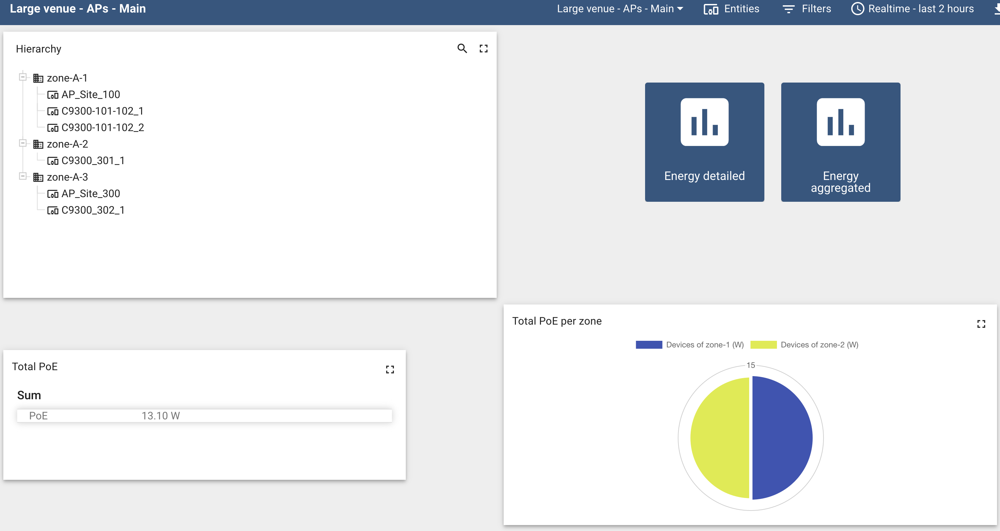

Based on the **measured consumption with PoE**, visualize the following information for the APs (similar to the switches dashboard):
- hierarchy with zones and APs
- total PoE per site (instantaneous)
- total PoE per zone (instantaneous)
- total daily/weekly/monthly energy (historical - aggregated)

Detailed visualizations:
- PoE per AP, for each zone (historical)
- total daily energy for each zone (historical - last 7 days)

The dashboards for the switches and APs are available here:
- Large venue - APs - Main
  - Large venue - APs - aggregated
    - Large venue - APs - Energy - daily
    - Large venue - APs - Energy - weekly
    - Large venue - APs - Energy - monthly
  - Large venue - APs - Energy - detailed
- Large venue - Switches - Main

Each dashboard requires the editing of Entities and Filters with the right site and zone names. There are available in edit mode, and can be found in the bar at the top right.

More panels can be created for additional zones by using the copy/paste function.

Large venue - APs - Main

Large venue - Switches - Main

